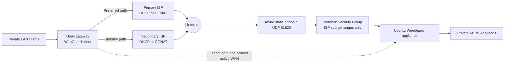
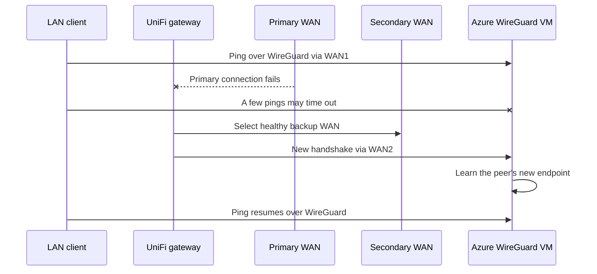

# VM-based UniFi-to-Azure WireGuard VPN

Deploy a low-cost Ubuntu VM as a WireGuard gateway between a UniFi gateway and an Azure virtual network. The scripts create the resource group, VNet, subnet, NSG, static public IP, NIC, and VM; install WireGuard; and generate an importable UniFi VPN Client profile.

## Why this is useful

This provides private, routed access from a UniFi LAN to workloads in Azure. The VM approach is cheaper than an Azure VPN Gateway and is compatible with a home connection behind CGNAT, provided you are comfortable managing the operating system that terminates the VPN. You are responsible for patching, hardening, monitoring, and troubleshooting the VM throughout its lifetime. It is useful for labs, development environments, administration, and small networks where that operational tradeoff is acceptable. The Ubuntu VM itself is also an immediate private ping target, making end-to-end validation straightforward before other Azure workloads are added.

The design works when the UniFi gateway is behind **carrier-grade NAT (CGNAT)**, ordinary ISP NAT, or a connection without a fixed public IP. CGNAT means the ISP shares one public IPv4 address among multiple customers and gives the customer router a private address inside the ISP network. The customer therefore cannot accept unsolicited inbound Internet connections or configure port forwarding on the ISP's outer NAT device.

This rules out the conventional site-to-site IPsec design used here, which expects the home VPN endpoint to have a directly reachable and stable public IP address. Even without CGNAT, a public address assigned by DHCP may change and make an IP-based peer definition unreliable. Some IPsec products can traverse NAT or use dynamic peers, but that requires compatible features and does not provide a public address controlled by the customer.

The Azure VM instead has the static public endpoint, while the UniFi gateway initiates the WireGuard session outbound. Therefore:

- No inbound port forwarding or public IPv4 address is required on the UniFi side.
- CGNAT does not prevent tunnel establishment because return packets use the outbound NAT state created by the UniFi gateway.
- `PersistentKeepalive = 25` keeps that NAT mapping active and helps re-establish it after an address or path change.
- WireGuard endpoint roaming lets Azure learn the most recent public source IP and UDP port used by the UniFi peer.

It also works with **multiple Internet connections** on the UniFi gateway. The WireGuard client follows the gateway's normal WAN selection and does not need to be bound to a specific WAN interface. In failover mode, UniFi moves outbound traffic to the surviving connection; WireGuard then sends from the new NAT/public endpoint, which Azure learns automatically.

The Azure NSG restricts UDP 51820 to public source networks supplied at deployment. Include a suitable ISP egress range for every WAN. A `/32` is ideal for a static address, but it can lock out a connection using DHCP or CGNAT when its public address changes. For a dynamic service, use the narrowest stable public range your ISP confirms it may assign. This is broader than one address but substantially safer than exposing the port to the entire Internet.

## Example network connectivity



The UniFi gateway always initiates the tunnel outbound. CGNAT therefore does not require inbound forwarding at home. After failover, WireGuard endpoint roaming updates the peer's observed source address on the Azure VM without changing the VPN profile.



## Default topology

The defaults are examples and can be overridden with environment variables.

| Item | Default |
|---|---|
| Azure region | West Europe |
| Resource group | `unifi-azure-vpn-test` |
| Azure VNet | `10.240.20.0/24` |
| VM subnet | `10.240.20.0/27` |
| VM private/ping IP | `10.240.20.4` |
| VM size | `Standard_B1ls` |
| OS | Ubuntu Server 22.04 LTS |
| OS disk | 32 GiB Standard HDD LRS |
| WireGuard network | `172.31.254.0/30` |
| Azure WireGuard IP | `172.31.254.1` |
| UniFi WireGuard IP | `172.31.254.2` |
| Example UniFi LAN | `192.168.10.0/24` |
| WireGuard port | UDP 51820 |

The deployment checks the proposed Azure and WireGuard prefixes against every VNet prefix in the selected subscription and exits on overlap. It also checks both prefixes against `LAN_CIDR`.

## Security

- UDP 51820 is limited to the ISP source networks supplied in `WIREGUARD_SOURCE_CIDRS`.
- Public SSH is opened only to the deployer's detected `/32` during bootstrap and removed automatically when deployment completes.
- After the VPN is configured, SSH is available only through the WireGuard address.
- SSH uses a generated Ed25519 key rather than passwords.
- The generated UniFi private key is downloaded into `udm-wireguard.conf`, removed from the VM, and stored locally with mode 600.
- Generated keys and configuration are excluded by `.gitignore`.

Never publish `udm-wireguard.conf` or the `.ssh` directory.

## Prerequisites

- An Azure subscription and permission to create resource groups, networking, and VMs
- Azure CLI (`az`)
- OpenSSH (`ssh`, `scp`, and `ssh-keygen`)
- `curl`
- A UniFi Cloud Gateway or Next-Gen Gateway supporting WireGuard VPN Client

## Deploy

Make the scripts executable:

```shell
chmod +x deploy.sh configure-wireguard.sh destroy.sh
```

Run the deployment script:

```shell
./deploy.sh
```

It prompts, with descriptions and examples, for three required values:

- `SUBSCRIPTION_ID`: the Azure subscription UUID where resources will be created.
- `LAN_CIDR`: the private LAN behind the UniFi gateway that must reach Azure.
- `WIREGUARD_SOURCE_CIDRS`: space-separated public ISP ranges allowed to reach UDP 51820. Include every WAN used for failover.

Alternatively, provide all three as environment variables for unattended deployment:

```shell
SUBSCRIPTION_ID="00000000-0000-0000-0000-000000000000" \
LAN_CIDR="192.168.10.0/24" \
WIREGUARD_SOURCE_CIDRS="198.51.100.0/24 203.0.113.0/24" \
./deploy.sh
```

The public ranges above are documentation-only examples. Ask each ISP which public egress range can be used by your connection. With a static address, use its `/32`. With DHCP or CGNAT, prefer the smallest stable ISP range that covers address changes. The deployment refuses `Internet`, `*`, and `0.0.0.0/0`.

If Azure CLI is not authenticated, the script invokes `az login`. It refuses to alter an existing resource group.

Common overrides:

```shell
SUBSCRIPTION_ID="00000000-0000-0000-0000-000000000000" \
RESOURCE_GROUP="my-unifi-vpn-test" \
LOCATION="uksouth" \
VNET_CIDR="10.241.0.0/24" \
SUBNET_CIDR="10.241.0.0/27" \
VM_PRIVATE_IP="10.241.0.4" \
LAN_CIDR="192.168.50.0/24" \
WIREGUARD_SOURCE_CIDRS="198.51.100.0/24 203.0.113.0/24" \
./deploy.sh
```

Keep `VNET_CIDR`, `SUBNET_CIDR`, `VM_PRIVATE_IP`, `WG_CIDR`, `WG_SERVER_IP`, and `WG_UDM_IP` internally consistent when overriding them.

## Configure UniFi

UI labels vary by UniFi Network version.

The deployment generates `udm-wireguard.conf`, a pre-generated WireGuard profile containing the keys, tunnel addresses, Azure endpoint, and Azure routes needed for import. The steps below cover importing that profile and creating a basic UniFi policy route, but they cannot determine how every home network should be routed.

You must understand and adapt the LAN-side routing for your environment, including which clients or VLANs may use the tunnel, firewall and isolation policies, return paths, and any overlapping private address ranges. Importing the profile establishes the tunnel; it does not automatically select all home-network traffic that should use it.

1. Open **Settings > VPN > VPN Client**.
2. Create a WireGuard VPN Client and import the generated `udm-wireguard.conf`.
3. Name it **Azure WireGuard** and enable it. The client should become **Connected**.
4. Create a policy route. Imported VPN Client traffic is not selected automatically:
   - Network 9.4: **Settings > Policy Table > Create New Policy > Route**
   - Network 9.3: **Settings > Policy Engine > Policy-Based Routes > Create Route**
   - Interface: **Azure WireGuard**
   - Source: the UniFi LAN represented by `LAN_CIDR`
   - Destination: select **IP**, then **Add IP Address**
   - IP address: the value of `VM_PRIVATE_IP`
   - Port: blank
   - Kill switch: disabled for initial testing
5. Save/apply the route.
6. If the source LAN is isolated, add an allow rule from `LAN_CIDR` to `VNET_CIDR` before its deny rule.

To route the complete Azure network, use an IP range spanning the VNet or a CIDR if the installed UniFi Network version accepts CIDR input.

### Dual WAN

The WireGuard client normally follows the gateway's WAN routing:

- In failover mode it uses the primary WAN and re-establishes through the backup after failure.
- In load-balancing mode connection hashing selects a WAN and preserves session stickiness.
- The Azure NSG must contain the possible public egress range for each WAN.
- WireGuard learns the peer's latest endpoint, so the profile does not contain separate primary and secondary peer addresses.

There is no need to bind the VPN Client to WAN1 or WAN2. `PersistentKeepalive = 25` helps the tunnel recover after CGNAT mapping, public-address, or WAN changes. Do not route the Azure WireGuard server's public endpoint through the WireGuard client itself.

### Test failover

1. Start a continuous ping from a LAN client to `VM_PRIVATE_IP`.
2. Confirm the ping is using the VPN and that `sudo wg show` on Azure reports a recent handshake.
3. Disable the primary WAN in UniFi or unplug its Internet connection. Do not disconnect the LAN side of the gateway.
4. Watch UniFi select the secondary WAN. A working setup commonly loses only a few pings while WAN failure is detected and WireGuard performs a new handshake; exact timing depends on UniFi health checks and both ISPs.
5. Confirm pings resume and `sudo wg show` reports a new peer endpoint and increasing transfer counters.
6. Restore the primary WAN and repeat the observations during recovery.

If failover does not recover, confirm the secondary ISP's current public address falls within `WIREGUARD_SOURCE_CIDRS` and that it permits outbound UDP 51820.

### VPN-only SSH

After importing the profile and enabling the policy route, connect to the appliance through its WireGuard address:

```shell
ssh -i .ssh/unifi-azure-vpn azureadmin@172.31.254.1
```

TCP 22 is not allowed on the Azure public interface after deployment. Azure Run Command can provide temporary diagnostics without opening SSH. This project intentionally favors a disposable appliance: if VPN recovery fails completely, delete the resource group and redeploy instead of leaving a permanent public management port.

## Test and troubleshoot

From a workstation on `LAN_CIDR`, ping `VM_PRIVATE_IP`. The first packet may be lost while the tunnel establishes.

On the Azure VM:

```shell
sudo wg show
ip route
sudo systemctl status wg-quick@wg0
```

- No handshake: verify keys, endpoint, outbound UDP 51820, and the Azure NSG.
- Handshake but no ping: verify the mandatory UniFi policy route and LAN firewall rules.
- Ping reaches Azure but no reply: verify `AllowedIPs`, Linux routes, and reverse-path firewall rules.

## Estimated cost

Example pay-as-you-go pricing for West Europe in USD, checked in September 2026:

| Resource | Example rate | Approx. 730-hour month |
|---|---:|---:|
| `Standard_B1ls` Linux VM | $0.006/hour | $4.38 |
| Standard static IPv4 | $0.005/hour | $3.65 |
| 32 GiB Standard HDD LRS | $1.536/month | $1.54 |
| VNet, subnet, NIC, NSG | No base charge | $0.00 |
| **Estimated fixed total** | | **$9.57/month** |

Inbound transfer is free; outbound transfer may be billed. Prices vary by region, date, agreement, and currency. Check the [Azure pricing calculator](https://azure.microsoft.com/pricing/calculator/) before deployment.

Deallocating the VM stops compute charges, but its disk and public IP continue billing. Delete the resource group when testing is complete.

## Remove

Run `./destroy.sh`. It prompts for the required Azure subscription UUID and asks for confirmation before deleting the default resource group.

Alternatively, use the same subscription and resource group values used for deployment as environment variables:

```shell
SUBSCRIPTION_ID="00000000-0000-0000-0000-000000000000" \
./destroy.sh
```

The local SSH key and UniFi profile are retained intentionally. Delete them securely and remove the VPN Client from UniFi when no longer needed.

## License

MIT
